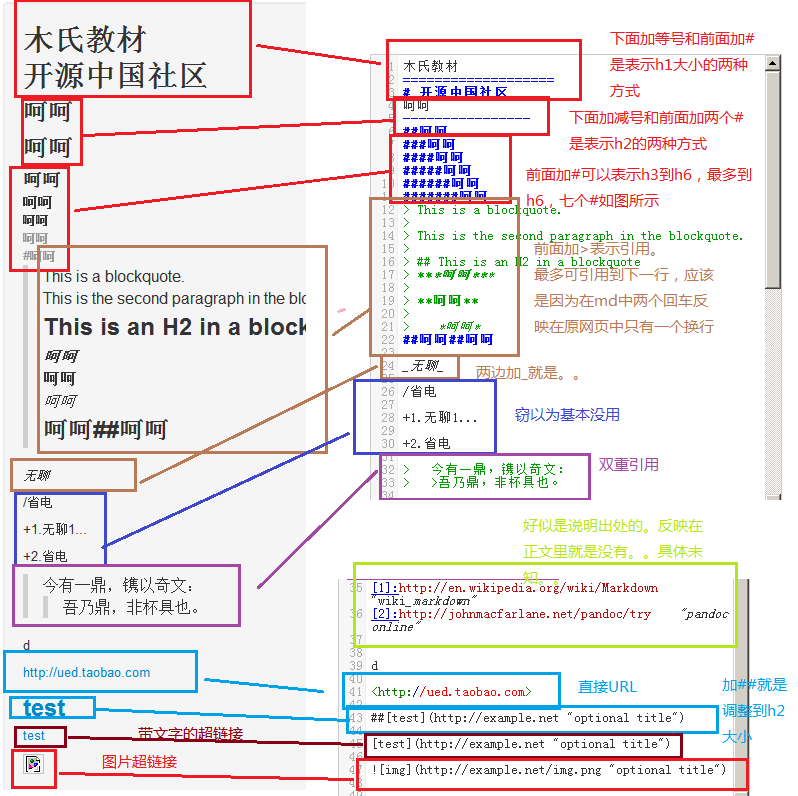

Markdown 教程
==============================
## what is Markdown

- tool for text-to-HTML conversion
- an easy-to-read, easy-to-write plain text format
- convert to structurally valid XHTML(or HTML) freely

## what problem Markdown solve

1. HTML is hard and complex to write 
2. HTML Tag is so hard to read for person

## how Markdown solve this problem

Markdown do the below two things

1. provide a plain text formatting syntax
2. provide a software tools that converts the plain text formatting to HTML

## For example

